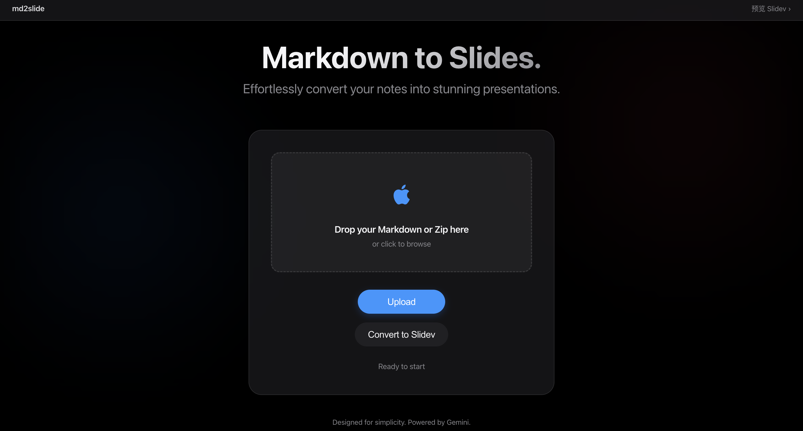
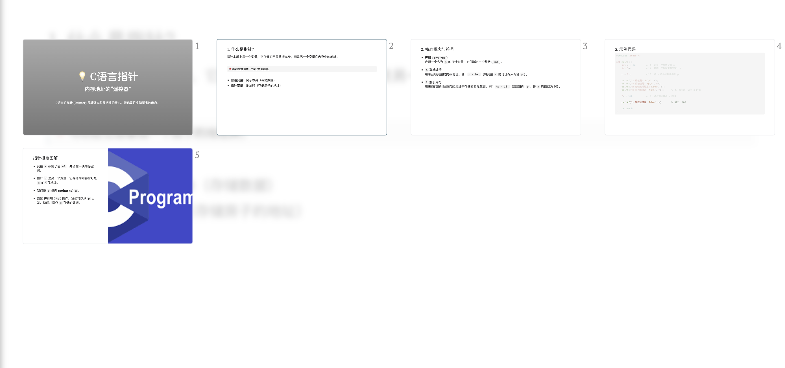

# md2slide

<div align="center">
  
  
</div>

## 简介

一个使用 Gemini 大模型与 Slidev 的 Markdown → 幻灯片转换工具。支持上传 Markdown 文件或包含图片的 Zip 包，自动生成精美的 Slidev 演示文稿。

## 功能特性

- 📄 **多格式支持**：支持上传 `.md` 单文件或 `.zip` 压缩包（包含图片资源）。
- 🖼️ **资源自动处理**：自动解析并重写图片路径，支持中文文件名。
- 🤖 **AI 驱动布局**：利用 Gemini 模型自动分析内容，生成符合 Slidev 规范的分页与版式。
- ⚡ **即时预览**：集成 Slidev 开发服务器，转换完成后可直接在线预览。

## 部署与运行

### 1. 环境准备
- Python 3.12+
- Node.js

### 2. 安装依赖

**Python:**
```bash
pip install flask google-genai
```

**Node.js:**
```bash
npm install
```

### 3. 启动项目

你需要同时运行 Flask 后端和 Slidev 服务。

**设置 API Key 并启动 Flask:**
```bash
export GOOGLE_API_KEY=你的_GEMINI_API_KEY
npm run flask
```

**启动 Slidev:**
```bash
npm run slidev
```

